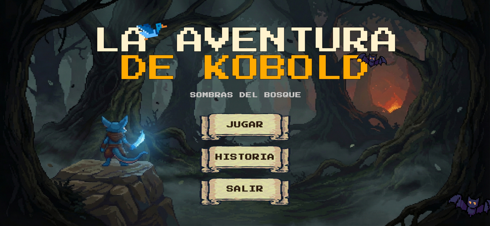
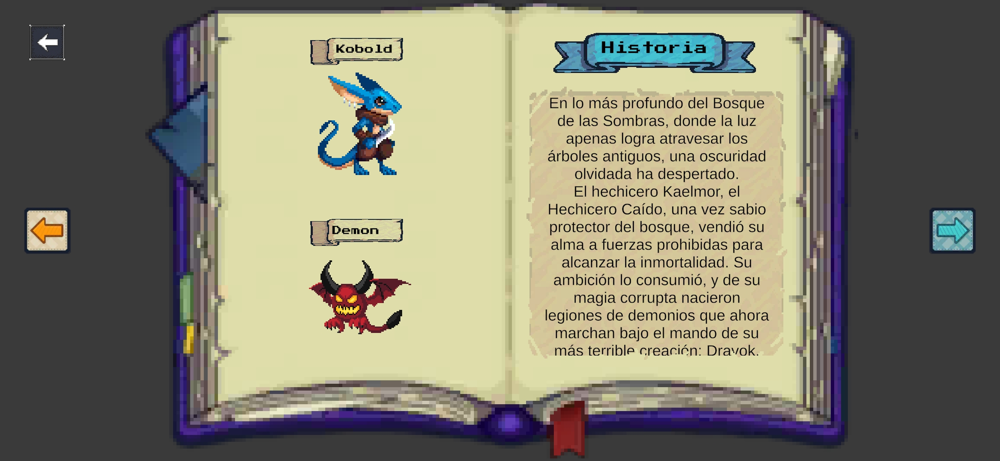
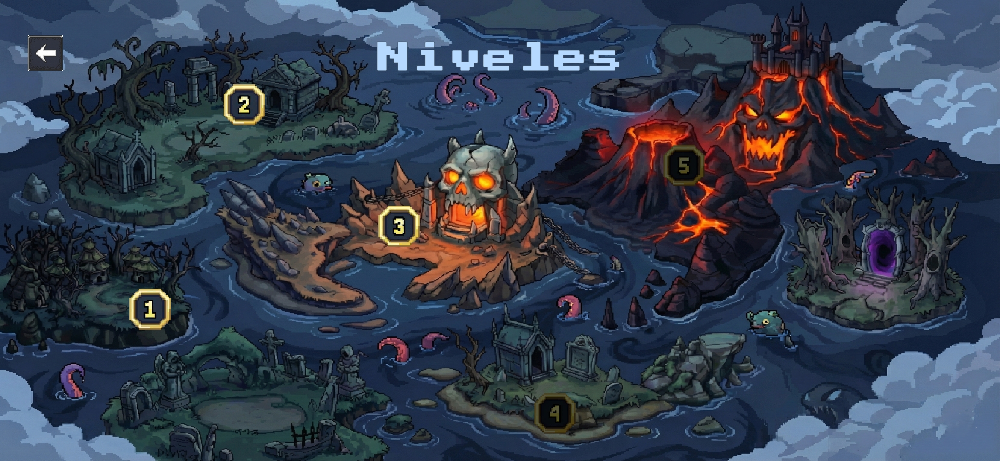
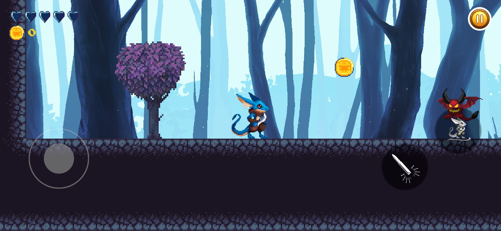

# 🎮 La Aventura de Kobold: Sombras del bosque

> A 2D action-platformer built with Unity 6, featuring projectile combat, enemy AI, and cross-platform controls.

---

## 📖 Descripción

**Kobold Adventure** es un videojuego 2D de plataformas y acción donde el jugador asume el rol de un Kobold guerrero en su travesía por territorios dominados por demonios. El juego combina mecánicas clásicas de plataformas —salto, movimiento lateral y combate por proyectiles— con efectos visuales modernos impulsados por el **Universal Render Pipeline (URP)** de Unity 6.

Desarrollado como proyecto final del curso de *Diseño y Desarrollo de Juegos Interactivos*, este proyecto pone en práctica principios de programación orientada a componentes en C#, diseño de niveles por escenas, manejo del ciclo de vida de objetos en Unity, y soporte nativo para controles multiplataforma.

---

## 🕹️ Mecánicas del Juego

| Mecánica | Descripción |
|---|---|
| **Movimiento** | Desplazamiento horizontal fluido con flip de sprite automático según la dirección. |
| **Salto** | Detección de suelo por `OverlapCircle` para evitar doble salto. |
| **Disparo** | Proyectiles con cooldown (0.25s) en la dirección que mira el personaje. |
| **Sistema de Vida** | 5 puntos de vida representados por un HUD de corazones animados. |
| **Recepción de Daño** | Efecto de rebote físico (*knockback*) y estado de invencibilidad temporal. |
| **Recolección de Monedas** | Contador en tiempo real con audio feedback. |
| **Enemigos (Demonios)** | IA con 3 puntos de vida, detección de jugador por colisión y animaciones de daño/muerte. |
| **Plataformas Móviles** | Plataformas con movimiento interpolado y lógica de *parenting* al jugador. |
| **Parallax Scrolling** | Capas de fondo con desplazamiento diferencial para generar profundidad visual. |
| **Selector de Niveles** | Sistema modular con niveles bloqueados/desbloqueados, carga dinámica de sprites. |

---

## 🗺️ Estructura de Escenas

```
MainMenu  →  Story  →  LevelSelector  →  Level1 / Level2 / Level3  →  Final
```

| Escena | Función |
|---|---|
| `MainMenu` | Pantalla de inicio con opciones: Jugar, Historia, Salir. |
| `Story` | Pantalla narrativa con scroll automático para introducir la historia. |
| `LevelSelector` | Menú visual de selección con niveles bloqueados/desbloqueados. |
| `Level1` | Nivel principal completo con todas las mecánicas activas. |
| `Level2` | Segundo nivel del juego. |
| `Level3` | Tercer nivel del juego. |
| `Final` | Pantalla de conclusión o créditos. |

---

## 🖥️ Controles

### ⌨️ Teclado (PC)
| Acción | Tecla |
|---|---|
| Moverse | `A` / `D` o `←` / `→` |
| Saltar | `W` o `↑` |
| Disparar | `Espacio` (disparo continuo) |

### 📱 Táctil (Mobile)
| Acción | Control |
|---|---|
| Moverse | Joystick virtual izquierdo |
| Saltar | Botón `Jump` en pantalla |
| Disparar | Botón `Fire` en pantalla (disparo continuo) |

---

## 🏗️ Arquitectura del Proyecto

```
Assets/
├── Animations/          # Controladores y clips de animación (Kobold, Demonios, Barrel)
├── Audio/
│   ├── Music/           # Música de fondo por escena
│   └── SFX/             # Efectos de sonido (disparos, monedas, daño)
├── Joystick Pack/       # Plugin de joystick virtual para controles móviles
├── Materials/           # Materiales URP 2D
├── Prefabs/             # Prefabs reutilizables (Bala, Enemigos, UI)
├── Scenes/              # Todas las escenas del juego
├── Scripts/
│   ├── Background/      # ParallaxMovimiento.cs
│   ├── Enemies/         # DemonScript.cs
│   ├── Environment/     # MovingPlatform.cs, PlatformAttach.cs
│   ├── LevelSelector/   # LevelSelectorManager.cs, LevelButtonData.cs, LevelButtonAnimation.cs
│   ├── MainCamara/      # CamaraController.cs
│   ├── Menu/            # MenuSystem.cs, UIManager.cs
│   └── Player/          # Kobold.cs, BalaScript.cs
├── Sprites/
│   ├── Backgrounds/     # Arte de fondos en capas para efecto parallax
│   ├── Enemies/         # Sprite sheets de enemigos
│   ├── Environment/     # Tiles, plataformas y elementos del entorno
│   ├── Player/          # Sprite sheets del Kobold
│   └── Tiles/           # Tiles para diseño de niveles con Tilemap
└── UI/                  # Sprites de interfaz (corazones, botones, HUD)
```

---

## 🛠️ Stack Tecnológico

| Categoría | Tecnología / Herramienta |
|---|---|
| **Motor** | Unity 6 (v6000.2.6f2) |
| **Lenguaje** | C# |
| **Renderizado** | Universal Render Pipeline (URP) 17.2.0 |
| **Controles** | Unity New Input System 1.14.2 |
| **UI** | Unity UGUI 2.0.0 · TextMeshPro |
| **Animación** | Unity Animator · Unity 2D Animation 12.0.2 |
| **Tilemaps** | Unity 2D Tilemap · Tilemap Extras 5.0.1 |
| **Sprites** | Unity 2D Sprite · Aseprite Importer 2.0.1 |
| **Controles Móviles** | Joystick Pack (Asset de la Unity Asset Store) |
| **IDE** | Visual Studio 2022 / JetBrains Rider |
| **Control de Versiones** | Git · GitHub |

---

## 📸 Capturas de Pantalla

<!--
### 🎬 Gameplay


-->

### 🏠 Menú Principal



### 📜 Historia



### 📋 Selector de Niveles



### ⚔️ Combate



---

## 🚀 Cómo Ejecutar el Proyecto

### Requisitos Previos

- **Unity Hub** instalado
- **Unity 6** (versión `6000.2.6f2` o superior) con el módulo **Universal Windows Platform / Android** si deseas compilar para esas plataformas.

### Pasos

1. **Clona el repositorio:**
   ```bash
   git clone https://github.com/Jorge-is/Kobold-Adventure-Game.git
   ```

2. **Abre el proyecto en Unity Hub:**
   - En Unity Hub, haz clic en **"Open"** → selecciona la carpeta `Kobold-Adventure-Game/`.
   - Acepta la instalación de la versión correcta de Unity si se solicita.

3. **Espera la importación de assets** (puede tardar unos minutos la primera vez).

4. **Abre la escena principal:**
   - En el panel *Project*, navega a `Assets/Scenes/`.
   - Abre la escena `MainMenu.unity`.

5. **Presiona ▶ Play** en el Editor de Unity para comenzar a jugar.

---

## 🧩 Scripts Principales

### `Kobold.cs` — Controlador del Jugador
Gestiona el movimiento, salto, disparo, sistema de vida (health hearts), colección de monedas y la lógica de recepción de daño con knockback. Soporta entrada dual: **teclado** y **controles táctiles** (joystick virtual + botones).

### `DemonScript.cs` — IA del Enemigo
Controla el comportamiento del enemigo Demonio: absorbe impactos de proyectiles, aplica daño al jugador al contacto directo y ejecuta animaciones de daño y muerte.

### `BalaScript.cs` — Proyectil del Jugador
Gestiona el movimiento del proyectil disparado, reproduce el efecto de sonido y se destruye al impactar con objetos o salir de pantalla.

### `LevelSelectorManager.cs` — Selector de Niveles
Genera dinámicamente los botones de nivel, gestiona el estado bloqueado/desbloqueado de cada nivel y carga la escena correspondiente al seleccionar un nivel.

### `ParallaxMovimiento.cs` — Efecto Parallax
Desplaza capas de fondo a distintas velocidades relativas a la cámara para crear una ilusión de profundidad.

### `MovingPlatform.cs` + `PlatformAttach.cs` — Plataformas Dinámicas
Implementan plataformas con movimiento entre dos puntos y la lógica para que el jugador sea "hijo" temporal de la plataforma mientras está sobre ella.

---

## 👨‍💻 Autor

**[Jorge Flores Arana]**
- 📧 [jorgeafa.19@gmail.com]
- 🔗 [LinkedIn](https://www.linkedin.com/in/jorge-flores-arana/)
- 🐙 [GitHub](https://github.com/Jorge-is)
<!--- 🌐 [Portafolio](https://tuportafolio.com) -->

---

## 📜 Licencia

Este proyecto fue desarrollado con fines educativos como parte del curso de **Diseño y Desarrollo de Juegos Interactivos**.

---

<div align="center">

⭐ Si te gustó el proyecto, ¡no olvides darle una estrella en GitHub! ⭐

*Desarrollado con ❤️ en Unity 6 — 2025*

</div>
